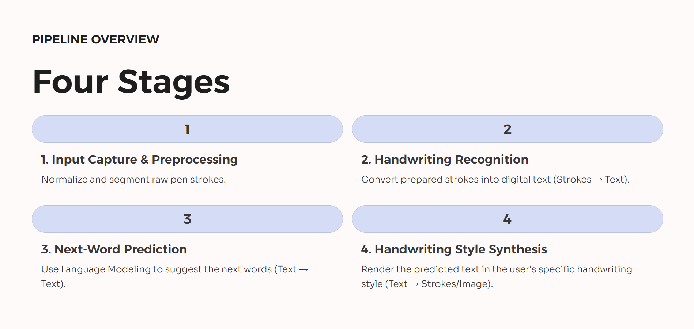
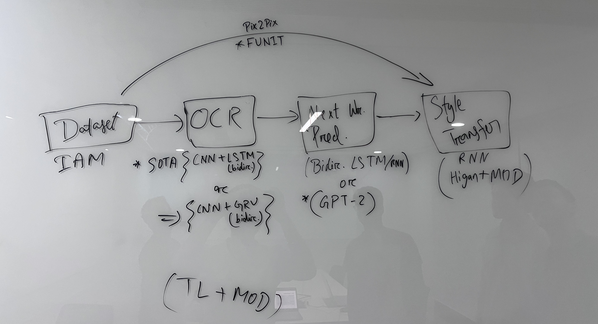

# ✍️ Handwriting Autocomplete System

A deep learning–based system for **predicting and auto-completing handwriting** in real time. The system captures handwritten text images, recognizes the text via OCR, predicts the next word using a language model, and (optionally) renders it in the user's handwriting style.

---

## 🧩 Pipeline Overview

The system operates in **three key phases**:

| Phase                             | Description                                         | Technology     |
| --------------------------------- | --------------------------------------------------- | -------------- |
| **Phase 1: OCR/HCR**              | Handwritten text recognition with word segmentation | CNN-LSTM + CTC |
| **Phase 2: Next Word Prediction** | Language model for predicting next words            | GPT-2          |
| **Phase 3: Style Transfer**       | Render text in user's handwriting style             | HiGAN+         |



---

## 📁 Project Structure

```
handwriting_autocomplete_system/
│
├── README.md                           # This file
├── LICENSE                             # License information
├── requirements.txt                    # Python dependencies
├── .gitignore                          # Git ignore rules
│
├── phase1_ocr/                         # Phase 1: OCR & Word Segmentation
│   ├── segmenter.py                    # Word segmentation module
│   ├── visualize.py                    # Visualization utilities
│   ├── sentence_recognizer.py          # Complete sentence OCR pipeline
│   ├── __init__.py                     # Package init
│   ├── README.md                       # Phase 1 documentation
│   ├── requirements.txt                # Phase 1 specific dependencies
│   │
│   ├── training/                       # OCR model training
│   │   ├── htr_cnn_lstm.py            # CNN-LSTM model architecture
│   │   ├── train_htr_iam.py           # IAM dataset training script
│   │   └── htr_nb_kaggle.ipynb        # Training notebook (Kaggle)
│   │
│   ├── model_weights/                  # Trained model weights
│   │   ├── htr_model_*.h5             # Trained OCR model
│   │   ├── encoder_*.pkl              # Character encoder
│   │   └── htr_nb.ipynb               # Model training notebook
│   │
│   └── tests/                          # Test scripts
│       ├── test_recognition.py         # Recognition tests
│       └── test_dataset.py             # Dataset validation tests
│
├── phase2_nextword_prediction/         # Phase 2: Next Word Prediction
│   ├── inference.py                    # GPT-2 inference script
│   ├── infer_pretrained.py            # Pretrained model inference
│   │
│   ├── src/                            # Core modules
│   │   ├── model.py                   # GPT-2 model architecture
│   │   ├── dataloader.py              # Data loading utilities
│   │   └── prepare_dataset.py         # Dataset preparation
│   │
│   ├── training/                       # Training scripts
│   │   └── train.py                   # GPT-2 training script
│   │
│   └── evaluation/                     # Evaluation scripts
│       └── hellaswag_eval.py          # HellaSwag benchmark evaluation
│
├── phase3_style_transfer/              # Phase 3: Handwriting Style Transfer
│   ├── README.md                       # HiGAN+ documentation
│   ├── ARCH.md                        # Architecture details
│   ├── TRAINING_ROADMAP.md            # Training guide
│   ├── QUICK_START.md                 # Quick start guide
│   ├── requirements.txt               # Dependencies
│   │
│   ├── code.ipynb                     # Main training notebook
│   ├── inference.ipynb                # Inference notebook
│   ├── run_generate.py                # Generation script
│   │
│   ├── configs/                        # Configuration files
│   │   ├── gan_iam.yml                # IAM dataset config
│   │   └── gan_iam_improved.yml       # Improved config
│   │
│   ├── lib/                            # Library modules
│   │   ├── __init__.py
│   │   ├── alphabet.py                # Character alphabet
│   │   ├── datasets.py                # Dataset loaders
│   │   ├── transforms.py              # Image transforms
│   │   ├── utils.py                   # Utilities
│   │   └── path_config.py             # Path configuration
│   │
│   ├── models/                         # Trained models
│   │   └── higanplus_trained.pth      # Trained HiGAN+ model
│   │
│   ├── inference/                      # Inference I/O
│   │   ├── input/                     # Input images
│   │   └── output/                    # Generated outputs
│   │
│   └── presentation/                   # Demo presentation
│       ├── index.html
│       ├── standalone.html
│       └── package.json
│
├── pipeline/                           # Integrated Pipeline
│   ├── complete_pipeline.py           # Full OCR → Prediction pipeline
│   ├── README.md                      # Pipeline documentation
│   └── integrated_pipeline_legacy.ipynb # Legacy notebook
│
├── experimental/                       # Experimental Approaches
│   └── writer_cyclegan/               # CycleGAN for style transfer
│       ├── CycleGAN.ipynb            # CycleGAN training
│       ├── pix2pix.ipynb             # Pix2Pix experiments
│       ├── train.py                  # Training script
│       ├── test.py                   # Testing script
│       ├── environment.yml           # Conda environment
│       ├── data/                     # Dataset modules
│       ├── models/                   # Model architectures
│       ├── options/                  # Configuration options
│       └── util/                     # Utilities
│
├── research_notebooks/                 # Research & Development
│   ├── pipeline_transfer_learning.ipynb  # Transfer learning experiments
│   ├── gan.ipynb                      # GAN experiments
│   ├── gan_ST.ipynb                   # Style transfer experiments
│   ├── README.md                      # Research notes
│   └── ST.MD                          # Style transfer documentation
│
└── image/                              # Documentation images
    └── README/                        # README images
```

---

## 🚀 Quick Start

### Prerequisites

```bash
# Clone the repository
git clone https://github.com/akshat3144/handwriting_autocomplete_system.git
cd handwriting_autocomplete_system

# Install dependencies
pip install -r requirements.txt
```

### Running the Complete Pipeline

```bash
cd pipeline
python complete_pipeline.py --image your_handwriting.jpg --predictions 5
```

This will:

1. Segment the handwritten text into individual words
2. Recognize each word using the trained OCR model
3. Predict the next word using GPT-2

---

## 📦 Phase Details

### Phase 1: OCR/Handwriting Recognition

**Location:** `phase1_ocr/`

The OCR phase uses a CNN-LSTM architecture with CTC loss for handwritten text recognition:

- **Word Segmentation**: Detects and extracts individual words from sentence images
- **Text Recognition**: CRNN model converts word images to text

```bash
# Run word segmentation
python phase1_ocr/segmenter.py --image sentence.jpg

# Run full sentence recognition
python phase1_ocr/sentence_recognizer.py --image sentence.jpg
```

### Phase 2: Next Word Prediction

**Location:** `phase2_nextword_prediction/`

Uses GPT-2 for next word prediction based on the recognized text:

```bash
# Run inference
python phase2_nextword_prediction/inference.py --prompt "Hello, I am a"
```

### Phase 3: Style Transfer (HiGAN+)

**Location:** `phase3_style_transfer/`

Generates handwritten text in the user's writing style using HiGAN+:

```bash
# Run generation
python phase3_style_transfer/run_generate.py --text "your text" --style_image sample.png
```

---

## 📂 Datasets

The project uses the **IAM Handwriting Dataset** for training and evaluation.

| Dataset                       | Link                                                                                    |
| ----------------------------- | --------------------------------------------------------------------------------------- |
| IAM Handwritten Forms Dataset | [Kaggle](https://www.kaggle.com/datasets/naderabdalghani/iam-handwritten-forms-dataset) |
| IAM Handwriting Word Database | [Kaggle](https://www.kaggle.com/datasets/nibinv23/iam-handwriting-word-database)        |

---

## 🔬 Experimental: CycleGAN Approach

**Location:** `experimental/writer_cyclegan/`

An alternative approach using CycleGAN for direct image-to-image style transfer, bypassing the OCR and next word prediction steps. This explores a different methodology for handwriting style transfer.

```bash
cd experimental/writer_cyclegan
python train.py --dataroot ./datasets/iam --name iam_cyclegan
```

---

## 🛠️ Technical Architecture

### OCR Model (Phase 1)

- **Architecture**: CNN (VGG-like) + Bidirectional LSTM
- **Loss**: CTC (Connectionist Temporal Classification)
- **Input**: 32×128 grayscale images
- **Output**: Variable-length text sequences

### Language Model (Phase 2)

- **Architecture**: GPT-2 (124M parameters)
- **Context Length**: 1024 tokens
- **Vocabulary**: 50,257 BPE tokens

### Style Transfer (Phase 3)

- **Architecture**: HiGAN+ (Hierarchical GAN)
- **Components**:
  - Style Encoder (VAE)
  - Generator (with GBlocks)
  - Dual Discriminators (Global + Patch)
  - Auxiliary networks (OCR, Writer ID)

---

## 📊 Model Performance

| Phase          | Metric                     | Value   |
| -------------- | -------------------------- | ------- |
| OCR            | Character Error Rate (CER) | ~8-12%  |
| OCR            | Word Error Rate (WER)      | ~25-35% |
| Style Transfer | FID Score                  | ~45-60  |

---

## 🚀 Features

- Real-time handwriting capture and normalization
- Stroke-to-text recognition using deep learning
- Next-word prediction via language modeling
- Handwriting-style synthesis for personalized rendering

## 📄 Projected Methodology



---

## 📜 License

This project is licensed under the MIT License - see the [LICENSE](LICENSE) file for details.

---

## 🙏 Acknowledgments

- IAM Database creators for the handwriting dataset
- OpenAI for the GPT-2 architecture
- HiGAN+ paper authors for the style transfer methodology
- PyTorch and TensorFlow teams

---

**Last Updated:** November 2025
