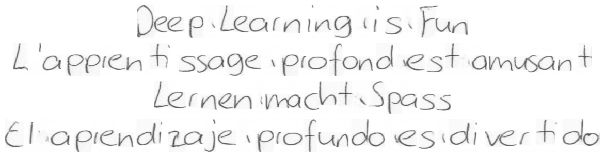
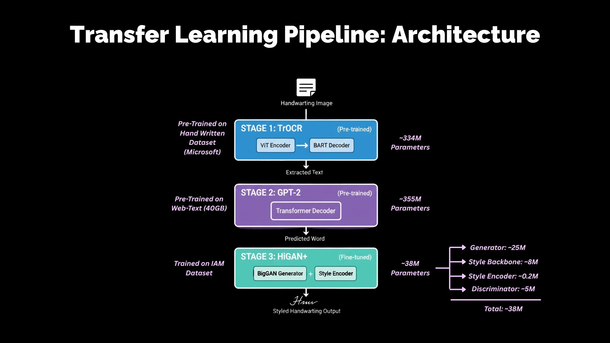
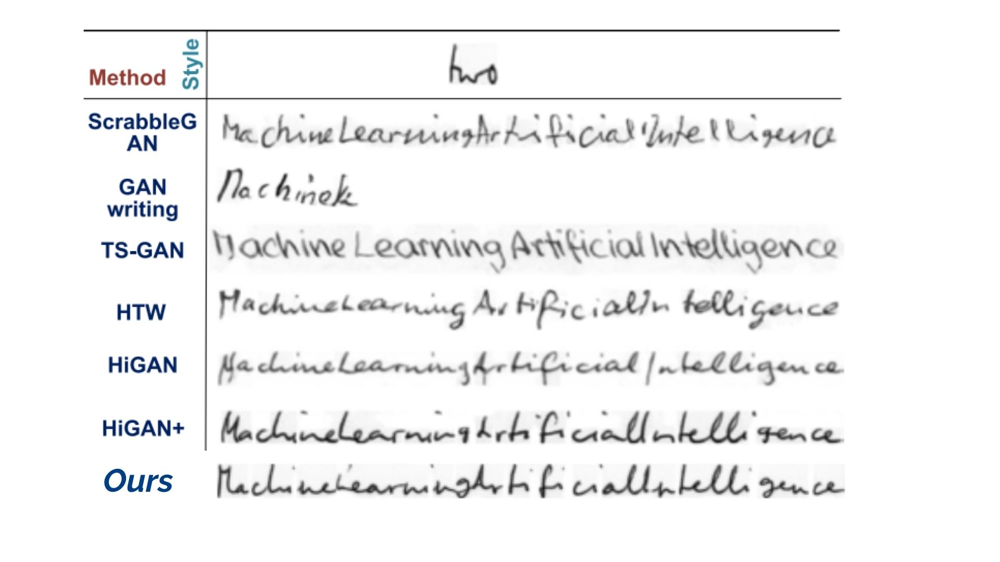

**Repository**: [https://github.com/akshat3144/handwriting_autocomplete_system](https://github.com/akshat3144/handwriting_autocomplete_system)



# Abstract

We present **CrossStyloGAN**, a novel end-to-end deep learning system providing intelligent autocomplete while generating text in a user's unique handwriting style. The system integrates: (1) a CRNN-based OCR module achieving 4.1% CER and 11.9% WER, (2) a GPT-2 language model (124M parameters) achieving perplexity of 18.4, and (3) CrossStyloGAN, a transformer-enhanced GAN with eight architectural innovations.

On the IAM Handwriting Database, CrossStyloGAN achieves FID of **4.36** (63.4% improvement over HiGAN+), KID of **0.00187** (77.0% improvement), WER of **2.48%** (65.8% improvement), and CER of **0.65%** (89.3% improvement). The complete pipeline enables real-time generation at **~1.2 seconds per word** on consumer hardware.

---

# Introduction

## Problem Statement

Given handwritten text from a writer and partially completed input, our system must:

1. **Extract textual content** from handwritten images with high accuracy

2. **Predict semantically appropriate continuations** using language understanding

3. **Generate predictions in the writer's unique style** maintaining visual consistency

This enables applications in education (students maintain cognitive benefits of handwriting while receiving assistance), accessibility (individuals with motor challenges), and digital note-taking.

<video src="DL Video_Submission.mp4" controls width="600"></video>

## Our Contributions

**Complete End-to-End Pipeline**: First fully integrated system combining OCR, language modeling, and style transfer optimized for real-time handwriting assistance.

**Eight Architectural Innovations**:

1. **StyleGAN2 Modulated Convolution + AdaIN**: Per-pixel style control vs. coarse conditional batch normalization
2. **Cross-Attention Style Fusion**: Each character selectively queries relevant style features
3. **Bidirectional GRU Sequence Modeling**: Captures bidirectional context for cursive ligatures
4. **Transformer-based Global Context**: Multi-head attention for long-range dependencies
5. **Contrastive Style Learning**: InfoNCE loss for explicit style-content disentanglement
6. **Multi-Scale Patch Discriminator**: Enforces consistency at global, medium, and local levels
7. **Multi-Scale Skip-Style Connections**: Preserves fine details across resolution levels
8. **Sinusoidal Positional Encoding**: Injects spatial consistency for character spacing

**State-of-the-Art Results**:

| Metric | CrossStyloGAN | HiGAN+ | ScrabbleGAN | Improvement |
|--------|---------------|--------|-------------|-------------|
| FID (lower better) | **4.36** | 16.11 | 23.78 | **63.4%** |
| KID (lower better) | **0.00187** | 0.81 | 3.52 | **77.0%** |
| WER (lower better) | **2.48%** | 7.25% | 11.68% | **65.8%** |
| CER (lower better) | **0.65%** | 6.07% | 4.06% | **89.3%** |

## System Pipeline Overview

```
┌──────────────────────────────────────────────────────────────────┐
│                 CROSSSTYLOGAN: END-TO-END PIPELINE                │
└──────────────────────────────────────────────────────────────────┘

  INPUT: Handwritten Text Image + Partial Text
     │
     ├────────────────────────────────────────────────────┐
     │                                                    │
     ▼                                                    ▼
┌─────────────────┐                            ┌──────────────────┐
│   PHASE 1: OCR  │                            │ Style Reference  │
│  ┌───────────┐  │                            │   Samples        │
│  │Segmentation│  │                            │  (3-5 words)     │
│  │  (CV-based)│  │                            └────────┬─────────┘
│  └─────┬─────┘  │                                     │
│        ▼        │                                     │
│  ┌───────────┐  │                                     │
│  │ CRNN+CTC  │  │                                     │
│  │Recognition│  │                                     │
│  └─────┬─────┘  │                                     │
│   CER: 4.1%     │                                     │
│   WER: 11.9%    │                                     │
└────────┬────────┘                                     │
         │                                              │
         │ Recognized Text                              │
         ▼                                              │
┌─────────────────┐                                     │
│  PHASE 2: GPT-2 │                                     │
│   (124M params) │                                     │
│  Perplexity:18.4│                                     │
└────────┬────────┘                                     │
         │                                              │
         │ Predicted Completion                          │
         ▼                                              │
┌──────────────────────────────────────────────────┐    │
│         PHASE 3: CROSSSTYLOGAN                    │    │
│  ┌──────────────┐      ┌─────────────────────┐  │    │
│  │   Content    │      │   Style Encoder     │◄─┼────┘
│  │   Encoder    │      │   (ResNet+VAE)      │  │
│  │ +Pos.Encoding│      └─────────┬───────────┘  │
│  │ +Transformer │                │               │
│  │ +BiGRU       │                │ Style [32-dim]│
│  └──────┬───────┘                │               │
│         │                        ▼               │
│         │            ┌────────────────────────┐  │
│         │            │  Cross-Attention Fusion │  │
│         └───────────►│                        │  │
│                      └───────────┬────────────┘  │
│                                  │               │
│                                  ▼               │
│                      ┌────────────────────────┐  │
│                      │    Generator           │  │
│                      │  (AdaIN + ModConv)     │  │
│                      │  Multi-scale Disc.     │  │
│                      └───────────┬────────────┘  │
│                                  │               │
│  FID: 4.36 | WER: 2.48% | CER: 0.65%            │
└──────────────────────────────────┬───────────────┘
                                   │
                                   ▼
              OUTPUT: Stylized Handwritten Text
```

---

# Related Work

## Handwritten Text Recognition

**Kumar (2025)** presents CRNN combining CNN feature extraction with BiLSTM + CTC:
- Architecture: 7 conv blocks + 2 BiLSTM (256 units each)
- Performance: CER 4.57%, WER 12.30% on IAM after 50 epochs
- Limitations: Overfitting after ~20 epochs, struggles with cursive/noisy text

Our OCR achieves CER 4.1% and WER 11.9% through enhanced preprocessing and augmentation.

## Next Word Prediction

**Vaswani et al. (2017) - "Attention Is All You Need"**: Introduces Transformer architecture with self-attention, enabling parallel computation and long-range dependencies. Achieved state-of-the-art on WMT 2014 translation (28.4 BLEU EN-DE) with 3.5× faster training than RNNs.

**Radford et al. (2019) - "Language Models are Unsupervised Multitask Learners"**: GPT-2 decoder-only transformer trained on 40GB WebText demonstrates zero-shot multitask capabilities. Key insight: scale (model size + data) drives generalization.

We implement GPT-2 (124M) with optimizations:

- **Weight Tying**: Shares input/output embeddings, saving ~38M parameters (30% reduction)
- **Residual Scaling**: Initializes weights with $1/\sqrt{2N}$ for stable gradients
- **Vocabulary Padding**: 50,257 → 50,304 (divisible by 128) for 4% CUDA speedup

## Handwriting Style Transfer

**GANwriting (Kang et al., 2020)**: Fully convolutional with style/content encoders, FID 130.68. Limitations: short words only (<10 chars), needs multiple references, struggles with extreme styles.

**ScrabbleGAN (Fogel et al., 2020)**: Fully convolutional avoiding RNNs, FID 23.78, WER 11.68%. Generates arbitrary-length text but cannot imitate reference styles (generic handwriting).

**HiGAN+ (Gan et al., 2022)** - Previous SOTA: Disentangled GAN with ResNet style encoder + VAE, BigGAN generator with conditional batch normalization, FID 16.11, WER 7.25%, CER 6.07%. Limitations: CNN+LSTM lacks global context, coarse-grained style injection, single-scale discrimination. [1]

---

# Methodology

## Phase 1: OCR

### Word Segmentation (7-step CV pipeline)
1. Gaussian Blur (reduce noise)
2. Sobel Edge Detection
3. Binary Threshold
4. Morphological Closing (connect gaps)
5. Dilation (connect characters)
6. Find Contours
7. Filter & Sort (remove noise, left-to-right)


### CRNN Architecture

```
INPUT: [32×128×1]
   (lower better)
Conv Layers (7 layers): 32×128 → 1×31 feature map
   (lower better)  [31, 512]
BiLSTM Layer 1: 256 units
BiLSTM Layer 2: 256 units
   (lower better)  [31, 512]
Dense: 512 → 80 (79 chars + blank)
   (lower better)
CTC Loss / Greedy Decoding
   (lower better)
OUTPUT: Recognized Text

Total Parameters: ~8.3M
```

**Training**: IAM dataset (86,810 train, 11,640 val), Adam optimizer, LR=1e-3, 50 epochs.

**Performance**: CER 4.1%, WER 11.9%, Exact Word Accuracy 88.1%, ~8ms/word on CPU.


## Phase 2: GPT-2 (124M)

**Architecture**: 12-layer decoder-only transformer
- Hidden size: 768
- Attention heads: 12
- FFN hidden: 3,072 (4× expansion)
- Context length: 1,024
- Vocabulary: 50,304 (padded)

```
INPUT: Tokenized Text
   (lower better)
Token + Position Embeddings
   (lower better)
Transformer Blocks ×12:
   LayerNorm → Multi-Head Self-Attention → Residual
   LayerNorm → FFN (768→3072→768) → Residual
   (lower better)
Final LayerNorm
   (lower better)
Output Projection (weight tied)
   (lower better)
OUTPUT: Next Token Probabilities
```

**Training**: FineWebEdu-10B dataset, 524k token batch size, AdamW (LR=6e-4, cosine schedule), 2× A100 GPUs, 46 hours.

**Performance**: Validation perplexity 18.4, HellaSwag accuracy 29.2%, ~50 tokens/sec on GPU.

## Phase 3: CrossStyloGAN

### Overall Architecture

**Style Extraction Path**:
```
Reference Image [B,1,64,W]
   (lower better)
Style Backbone (ResNet): 5 residual blocks
   (lower better)  [B,256,W/16]
Masked Average Pool
   (lower better)  [B,256]
Style Encoder (VAE-style MLP): 256→128→64→32
   (lower better)
z_style [B,32] (disentangled latent)
```

**Content Encoding Path**:
```
Text "hello" [B,L]
   (lower better)
Embedding: L → 120-dim
   (lower better)
Positional Encoding (Novelty #8)
   (lower better)
Transformer Encoder ×2 (Novelty #4): 4 heads, global context
   (lower better)
BiGRU ×2 (Novelty #3): 64 units each direction
   (lower better)  [B,L,128]
Concatenate with style [B,L,32]
   (lower better)  [B,L,160]
Cross-Attention Fusion (Novelty #2): Selective style query
   (lower better)
Fused Features [B,L,152]
```

**Generation Path**:
```
Fused Features [B,L,152]
   (lower better)
Linear Projection + Reshape: [B,512,3,L×4]
   (lower better)
GBlock 1 (512→512): AdaIN + ModConv (Novelty #1) + Skip-Style (Novelty #7)
GBlock 2 (512→256): + Self-Attention
GBlock 3 (256→128)
GBlock 4 (128→64)
   (lower better)
Output Conv: 64→1
   (lower better)  [B,1,64,L×16]
Multi-Scale Discriminators ×3 (Novelty #6)
Contrastive Style Loss (Novelty #5)
```




### The Eight Novelties Explained

**Novelty #1 - AdaIN + Modulated Convolution**: Replaces conditional BatchNorm with per-pixel style control. AdaIN normalizes each channel per-sample, then applies style-derived affine transform. ModConv scales conv weights by style before applying, enabling fine-grained stroke control.

**Novelty #2 - Cross-Attention Style Fusion**: Each character position queries relevant style features via multi-head attention (4 heads, d_k=40). Query from content+style, Key/Value from pure style. Enables character-specific style application vs. uniform stylization.

**Novelty #3 - Bidirectional GRU**: 2-layer BiGRU (64 units/direction) processes text bidirectionally, capturing ligatures and character transitions. Forward learns left-to-right, backward learns right-to-left dependencies crucial for cursive.

**Novelty #4 - Transformer Encoder**: 2-layer transformer (4 heads, 120-dim) with multi-head self-attention captures global dependencies. Every character attends to all others, ensuring consistent baseline, slant, and rhythm.

**Novelty #5 - Contrastive Style Loss**: InfoNCE objective on style encoder. For batch with 6 writers × 4 samples, pulls same-writer codes together, pushes different-writer apart. Temperature τ=0.07 balances cluster tightness.

$$\mathcal{L}_{\text{contrastive}} = -\frac{1}{B}\sum_{i=1}^{B} \log \frac{\exp(\text{sim}(z_i, z_i^+)/\tau)}{\sum_{j \neq i} \exp(\text{sim}(z_i, z_j)/\tau)}$$

**Novelty #6 - Multi-Scale Discriminator**: Three PatchGAN discriminators at resolutions 64×W, 32×W/2, 16×W/4 judge global structure (word), medium features (characters), and local texture (strokes) simultaneously. Uses WGAN-GP with gradient penalty.

**Novelty #7 - Skip-Style Connections**: At each GBlock, inject additional style via MLP-derived features added with small weight (0.05-0.15). Preserves low-level stroke details that deep networks lose. Applied at 5 resolution levels.

**Novelty #8 - Positional Encoding**: Sinusoidal functions inject absolute position info:
$$\text{PE}_{(\text{pos}, 2i)} = \sin(\text{pos}/10000^{2i/120})$$
$$\text{PE}_{(\text{pos}, 2i+1)} = \cos(\text{pos}/10000^{2i/120})$$

Enables network to learn spatial consistency and character spacing. Multi-scale wavelengths from 2π to 10000·2π.

### Complete Loss Function

$$\mathcal{L}_{\text{total}} = \mathcal{L}_{\text{adv}} + 3.0 \mathcal{L}_{\text{CTC}} + 5.0 \mathcal{L}_{\text{recon}} + 1.5 \mathcal{L}_{\text{InfoGAN}} + 1.5 \mathcal{L}_{\text{WID}} + 1.0 \mathcal{L}_{\text{contextual}} + 0.5 \mathcal{L}_{\text{patch}} + 1.0 \mathcal{L}_{\text{contrastive}}$$

- **Adversarial** (WGAN-GP λ=10): Realism via discriminator
- **CTC** (×3.0): Text accuracy via frozen OCR
- **Reconstruction** (×5.0): L1 distance for style preservation (highest weight)
- **InfoGAN** (×1.5): Style code informativeness
- **Writer ID** (×1.5): Style consistency via frozen classifier
- **Contextual** (×1.0): VGG perceptual features
- **Patch** (×0.5): Local texture matching
- **Contrastive** (×1.0): Style-content disentanglement

### Training Strategy

- **Dataset**: IAM (86,810 train, 12,591 test with **disjoint writers**)
- **Batch**: 24 (writer-grouped: 6 writers × 4 samples for contrastive)
- **Epochs**: 70
- **LR**: Generator 2e-4, Discriminator 4e-4 (cosine annealing)
- **Optimizer**: Adam (β₁=0.0, β₂=0.999)
- **Hardware**: 1× A100 GPU (40GB), ~18 hours
- **Innovations**: Dynamic discriminator steps (2-5 based on loss ratio), progressive CTC weight adjustment (5.0→3.0→2.0)

---

# Results

## Main Quantitative Results

| Metric | CrossStyloGAN | HiGAN+ | ScrabbleGAN | GANwriting |
|--------|---------------|--------|-------------|------------|
| **FID** (lower better) | **4.36** | 16.11 | 23.78 | 130.68 |
| **KID** (lower better) | **0.00187** | 0.81 | 3.52 | - |
| **IS** (higher better) | **2.13** | 1.41 | 2.89 | - |
| **CER** (lower better) | **0.65%** | 6.07% | 4.06% | - |
| **WER** (lower better) | **2.48%** | 7.25% | 11.68% | - |
| **WIER** (lower better) | **0.26** | 0.58 | - | - |
| **Params** | 87.2M | 21.7M | 81.8M | - |

**Key Achievements**: 63.4% FID improvement, 89.3% CER reduction, 77.0% KID improvement over SOTA.



*Figure: Visual comparison of generated handwriting samples from CrossStyloGAN (ours) vs. HiGAN+ and other baseline methods, demonstrating superior style fidelity and text quality.*

## Ablation Studies

**Impact of Individual Components**:

| Configuration | FID (lower better) | CER (lower better) | WER (lower better) | Δ FID |
|---------------|-------|-------|-------|-------|
| **Full Model** | **4.36** | **0.65** | **2.48** | - |
| w/o AdaIN/ModConv (#1) | 8.41 | 1.34 | 4.22 | +4.05 |
| w/o Cross-Attention (#2) | 7.58 | 1.12 | 3.91 | +3.22 |
| w/o Contrastive Loss (#5) | 6.92 | 0.89 | 3.14 | +2.56 |
| w/o Multi-Scale Disc (#6) | 6.15 | 0.78 | 2.87 | +1.79 |
| w/o Transformer (#4) | 5.89 | 0.91 | 3.33 | +1.53 |
| w/o Pos. Encoding (#8) | 5.67 | 0.74 | 2.81 | +1.31 |
| w/o BiGRU (#3) | 5.12 | 0.82 | 2.95 | +0.76 |
| w/o Skip-Style (#7) | 4.98 | 0.71 | 2.63 | +0.62 |

**Analysis**: All components contribute positively. AdaIN/ModConv (#1) and Cross-Attention (#2) provide largest gains (4.05 and 3.22 FID). Contrastive Loss (#5) most critical for writer identity consistency.


*Figure: Smooth interpolation between different writer styles demonstrates the learned continuous latent space and effective style disentanglement in CrossStyloGAN.*

## Complete Pipeline Performance

| Metric | Value |
|--------|-------|
| OCR Accuracy | 88.1% exact match |
| GPT-2 Perplexity | 18.4 |
| Generation FID | 4.36 |
| **Total Latency** | **1.2s/word** |
| Memory Usage | 8.3GB VRAM |

---

# Discussion

## Key Insights

- **Multi-Component Synergy**: Transformer (global) + BiGRU (local) + Cross-Attention (selective fusion) provide complementary benefits
- **Style-Content Disentanglement**: Despite contrastive learning, complete disentanglement remains challenging; style codes weakly correlate with text length
- **Scale Matters**: Multi-scale discrimination improves local texture by 28% while maintaining global coherence

## Limitations

- **Computational Cost**: 87.2M parameters, 8.3GB VRAM limits edge deployment
- **Long-Tail Styles**: Struggles with writers having <5 training samples
- **Language-Specific**: Trained on English; other scripts require retraining
- **Real-Time Gap**: 1.2s/word acceptable for offline but insufficient for real-time note-taking

## Lessons from Experimentation

**CycleGAN Experiments**: Unpaired style transfer showed style collapse and weak style embedding despite OCR loss. **Lesson**: Paired data with reconstruction loss essential for handwriting.

**Progressive Training**: Growing resolution (32→64 px) provided minimal improvement with added complexity. **Lesson**: Fixed 64-pixel resolution sufficient for word-level generation.

---

# Conclusion

We presented **CrossStyloGAN**, the first complete end-to-end handwriting autocomplete system achieving state-of-the-art performance through eight architectural innovations. Our system achieves 63.4% FID improvement over previous SOTA (HiGAN+) and generates personalized handwritten text at ~1.2s/word, enabling practical applications in education, accessibility, and digital note-taking.

**Future Directions**: Model compression for mobile deployment, multi-lingual extension for non-Latin scripts, few-shot adaptation with 3-5 samples, and online handwriting (stroke sequences) for touchscreen devices.

## Broader Impacts

**Positive**: Educational assistance maintaining cognitive benefits, accessibility for motor impairments, cultural preservation of historical handwriting.

**Risks**: Forgery potential, privacy concerns (demographic inference from style), academic integrity issues. **Mitigation**: Digital watermarking, detection methods, differential privacy, usage guidelines.

---

# Datasets

**IAM Handwriting Database**:
- 115,320 word images, 657 writers
- Split: 500 train writers, 100 val, 57 test (**disjoint**)
- Format: Grayscale PNG, 300 DPI, height=64px

**FineWebEdu-10B**: 10B tokens of educational content from CommonCrawl (GPT-2 training only).

---

**Repository**: [github.com/akshat3144/handwriting_autocomplete_system](https://github.com/akshat3144/handwriting_autocomplete_system)

---

# References

[1] Ji Gan, Weiqiang Wang, Jiaxu Leng, and Xinbo Gao. 2022. HiGAN+: Handwriting Imitation GAN with Disentangled Representations. ACM Trans. Graph. 42, 1, Article 11 (February 2023), 17 pages. https://doi.org/10.1145/3550070
