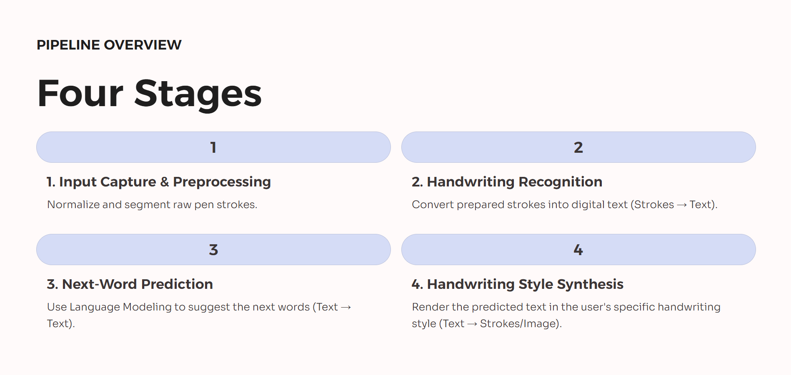

# ✍️ Handwriting Autocomplete System

A deep learning–based system for **predicting and auto-completing handwriting** in real time. The system captures pen strokes, recognizes handwritten text, predicts the next word, and renders it in the user's handwriting style.

---

## 🧩 Pipeline Overview

The system operates in **four key stages**:

- **Input Capture & Preprocessing**: Normalize and segment raw pen strokes.
- **Handwriting Recognition**: Convert preprocessed strokes into digital text (**Strokes → Text**).
- **Next-Word Prediction**: Use a language model to suggest the next words (**Text → Text**).
- **Handwriting Style Synthesis**: Render predicted text in the user's handwriting style (**Text → Strokes/Image**).

---

## 📂 Datasets

The project uses the **IAM Handwriting Dataset** for training and evaluation.

| Dataset                       | Link                                                                                                                                                        |
| ----------------------------- | ----------------------------------------------------------------------------------------------------------------------------------------------------------- |
| IAM Handwritten Forms Dataset | [https://www.kaggle.com/datasets/naderabdalghani/iam-handwritten-forms-dataset](https://www.kaggle.com/datasets/naderabdalghani/iam-handwritten-forms-dataset) |
| iam_handwriting_word_database | [https://www.kaggle.com/datasets/nibinv23/iam-handwriting-word-database](https://www.kaggle.com/datasets/nibinv23/iam-handwriting-word-database)               |

## 🚀 Features

* Real-time handwriting capture and normalization
* Stroke-to-text recognition using deep learning
* Next-word prediction via language modeling
* Handwriting-style synthesis for personalized rendering

## 📄 Projected Methodology

