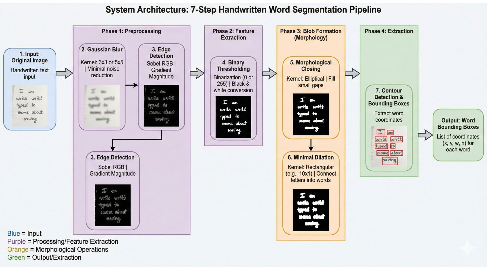
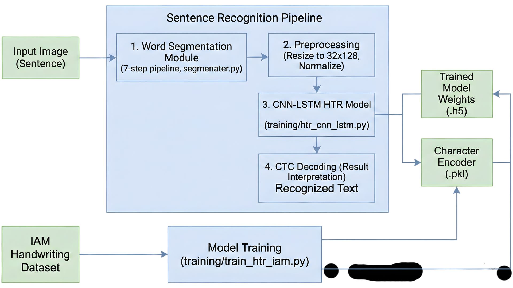
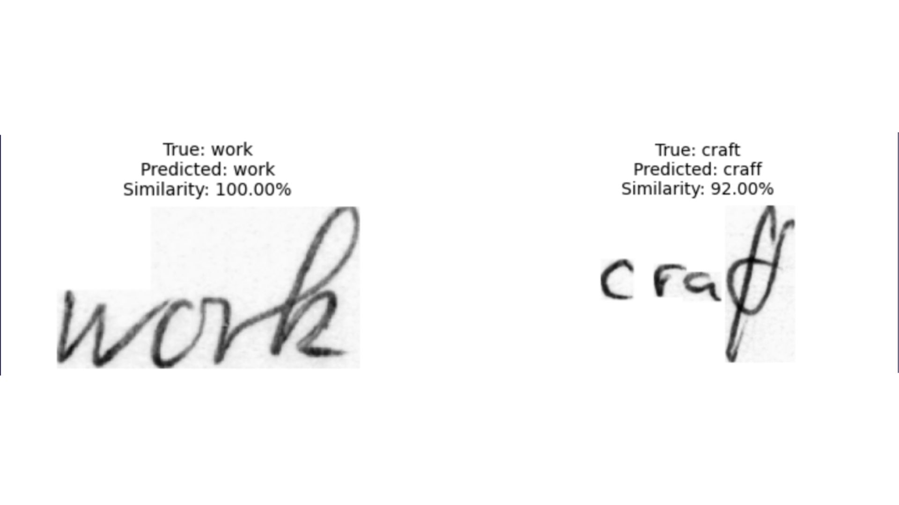
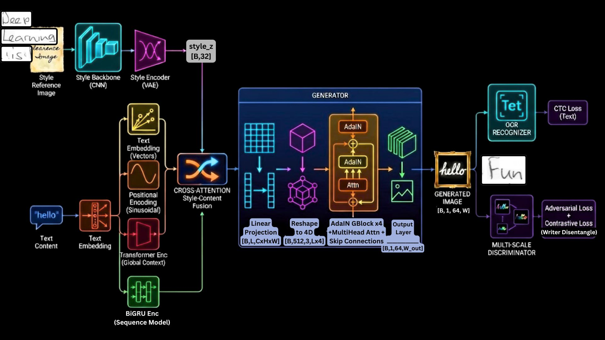
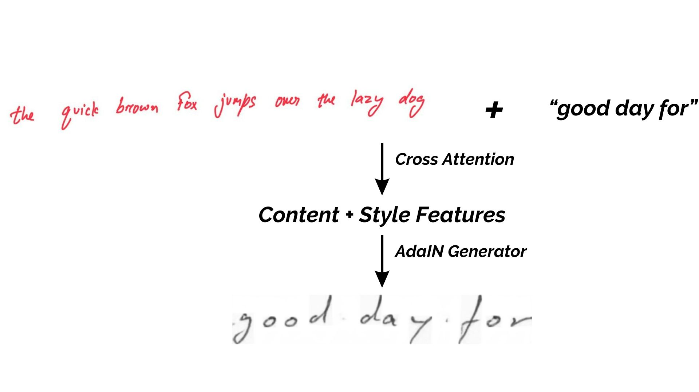
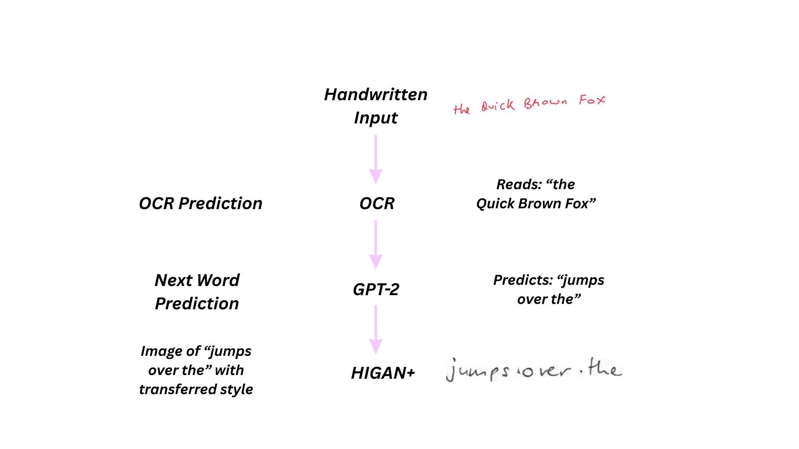

# Handwriting Autocomplete System: Project Report

**Team:** Abhijeet, Akshat, Devyansh A. & Raghav  

---

## 1. Executive Summary

This project aims to develop a **Handwriting Autocomplete System** that not only predicts the next word in a sentence but also generates that prediction in the user's unique handwriting style. The system integrates three major deep learning components: **Optical Character Recognition (OCR)** to understand the user's input, **Next Word Prediction (NWP)** to anticipate the user's intent, and **Handwriting Style Transfer** to render the prediction seamlessly.

By leveraging state-of-the-art architectures like CNN-LSTMs, Transformers (GPT-2), and our novel **CrossStyloGAN**, we address the complex challenge of maintaining semantic coherence while preserving the visual authenticity of handwritten text.

---

## 2. Project Overview

### Problem Statement
Handwriting remains a personal and expressive form of communication. However, digital tools often strip away this individuality, converting handwritten notes into standardized fonts. Our goal is to bridge this gap by creating an intelligent system that:
1.  **Reads** handwritten text despite variations in style, noise, and distortion.
2.  **Predicts** the next logical word(s) to assist the writer.
3.  **Imitates** the writer's specific style (slant, pressure, stroke width) to generate the predicted word.

### Core Components
The project is divided into three distinct phases:
*   **Phase 1: OCR** - Converting handwritten images to text.
*   **Phase 2: Next Word Prediction** - Generating semantic completions.
*   **Phase 3: Style Transfer** - Rendering text in a target handwriting style.

---

## 3. Phase 1: Optical Character Recognition (OCR)

### 3.1 Overview
The first step in our pipeline is to accurately digitize the user's handwritten input. We implemented a robust Handwritten Text Recognition (HTR) system capable of segmenting full sentences into words and recognizing them individually.

### 3.2 Word Segmentation
Before recognition, the input sentence image must be segmented into individual words. We developed a **7-step computer vision pipeline**.

*Figure 1: The 7-step word segmentation pipeline.*

The pipeline handles various challenges such as uneven spacing and noise, ensuring that the recognizer receives clean, isolated word images.

### 3.3 Model Architecture: CNN-LSTM
For the recognition task, we employed a **CRNN (Convolutional Recurrent Neural Network)** architecture.

*   **CNN Backbone:** Extracts spatial features (strokes, curves, shapes) from the word images.
*   **BiLSTM (Bidirectional LSTM):** Captures sequential dependencies, understanding the order of characters.
*   **CTC (Connectionist Temporal Classification) Loss:** Handles the alignment between the input image sequence and the output text sequence, allowing for variable-length inputs.

*Figure 2: The OCR model architecture and processing flow.*

### 3.4 Performance & Limitations
*   **Metrics:** We evaluated the model using Character Error Rate (CER) and Word Error Rate (WER).
*   **Strengths:** Performs well on standard datasets like IAM.
*   **Limitations:** Struggles with highly cursive text, extreme noise, or rare words not present in the training vocabulary.

*Figure 3: Example of OCR output from handwritten input.*

---

## 4. Phase 2: Next Word Prediction

### 4.1 Overview
Once the text is recognized, the system predicts the most likely next word. We utilized the **GPT-2 (Generative Pre-trained Transformer)** architecture for this task, leveraging its powerful language modeling capabilities.

### 4.2 Methodology
We followed a "from-scratch" implementation approach inspired by Andrej Karpathy, while also utilizing pre-trained checkpoints due to hardware constraints.

*   **Model Size:** 124 Million parameters.
*   **Context Length:** 1024 tokens.
*   **Vocabulary:** 50,257 BPE tokens.

### 4.3 Key Optimizations & Implementation Details
To ensure efficiency and stability, we implemented several advanced techniques:

1.  **Weight Tying:** The input embedding layer and the output head share weights. This reduces the model size by ~30% (saving ~38 million parameters) and enforces semantic logic where the input vector for "cat" matches the output prediction vector for "cat".
2.  **Residual Stream Initialization ($1/\sqrt{2N}$):** To prevent variance explosion in deep networks, we scaled the weights of residual layers. This ensures a "clean" signal propagation and stable training.
3.  **"Ugly Numbers" Optimization:** We padded the vocabulary size from 50,257 to **50,304**. Since 50,304 is divisible by 128, it allows CUDA kernels to fully saturate the GPU hardware, resulting in a ~4% speedup in training.

---

## 5. Phase 3: Handwriting Style Transfer

### 5.1 Overview
The final and most visually complex phase is generating the predicted word in the user's handwriting style. We developed **CrossStyloGAN**, a novel architecture that outperforms the existing state-of-the-art HiGAN+ by introducing significant architectural improvements for better style disentanglement and generation quality.

### 5.2 Architecture: CrossStyloGAN
Our proposed model introduces **8 major architectural novelties**, categorized into three key areas: Text Processing, Generator Enhancements, and Output Discrimination.

*Figure 4: The CrossStyloGAN architecture.*

#### A. Text Processing
To better capture the sequential nature of handwriting and global context, we enhanced the text encoding pipeline:

1.  **Positional Encoding (Novelty 8):** We injected sinusoidal positional encodings (from Transformers) into text embeddings. This provides the model with crucial sequence order information, ensuring consistent left-to-right flow and proper character spacing.
2.  **Global Context Modeling using Transformers (Novelty 4):** A multi-layer Transformer encoder with self-attention was added to capture global word-level patterns, allowing each character to "see" all other characters for better context.
3.  **Sequence Modeling using BiGRU (Novelty 3):** A Bidirectional GRU was employed to capture sequential dependencies (both left-to-right and right-to-left), essential for modeling ligatures and consistent slant.
4.  **Cross-Attention Fusion (Novelty 2):** Instead of simple concatenation, we implemented multi-head cross-attention where text queries attend to style keys/values. This allows the model to selectively apply style features relevant to specific characters.

#### B. Generator Side
We significantly upgraded the generator to improve style control and retention:

5.  **StyleGAN2-Style Control (Novelty 1):** We replaced standard conditional batch normalization with **AdaIN (Adaptive Instance Normalization)** and **Modulated Convolutions**. This allows for fine-grained, per-writer style control at the convolution level.
6.  **Skip-Connections for Multi-Scale Style Retention (Novelty 7):** We added skip connections that inject multi-scale style features from the encoder directly into different stages of the generator, preserving fine stroke details that are often lost in deep networks.
7.  **Writer-Disentangled Style via Contrastive Learning (Novelty 5):** We utilized InfoNCE contrastive loss to force the style encoder to cluster same-writer samples together and push different writers apart, effectively disentangling style from content.

#### C. Output Section
To ensure high-fidelity generation at both global and local levels:

8.  **Multi-Scale, Multi-Head Discriminator (Novelty 6):** We implemented a discriminator with a shared backbone and three specialized heads:
    *   **Global Head:** Evaluates overall word structure.
    *   **Patch Head:** Focuses on local texture and ink quality.
    *   **Character Head:** Attends to per-character quality.

### 5.3 Performance
The model was evaluated using metrics such as **FID (Fréchet Inception Distance)** for image quality and **WIER (Writer Identification Error Rate)** for style consistency. The dual-scale discriminator significantly reduced blurriness, resulting in sharper character boundaries.

*Figure 5: Generated samples showing the model's ability to mimic different handwriting styles.*

---

## 6. Integrated Pipeline

The full system operates as a seamless pipeline:

1.  **Input:** User writes a sentence (e.g., "the Quick Brown Fox").
2.  **OCR:** The system reads the text.
3.  **Prediction:** GPT-2 predicts the next word (e.g., "jumps").
4.  **Style Extraction:** The system analyzes the style of the input sentence.
5.  **Generation:** CrossStyloGAN generates the word "jumps" using the extracted style.
6.  **Output:** The user sees "jumps" appear in their own handwriting.

This end-to-end flow demonstrates the power of combining discriminative models (OCR), generative language models (GPT-2), and conditional image generation models (GANs) into a cohesive application.

*Figure 6: Example of the whole pipelin in action.*

---
